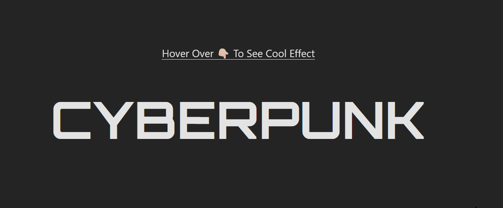

#  Beautiful Text Perplexing Effect

### All the necessary code is inside files:

- `App.tsx` [here](./src/App.tsx)  
  _That's about it_ 😉. _It's the only file_

## Output



### To run this project:

```bash
git clone <this-repo>
yarn
yarn dev
```

### Hit me up on Discord if you have any questions: `pratt#5772` ✌🏻
